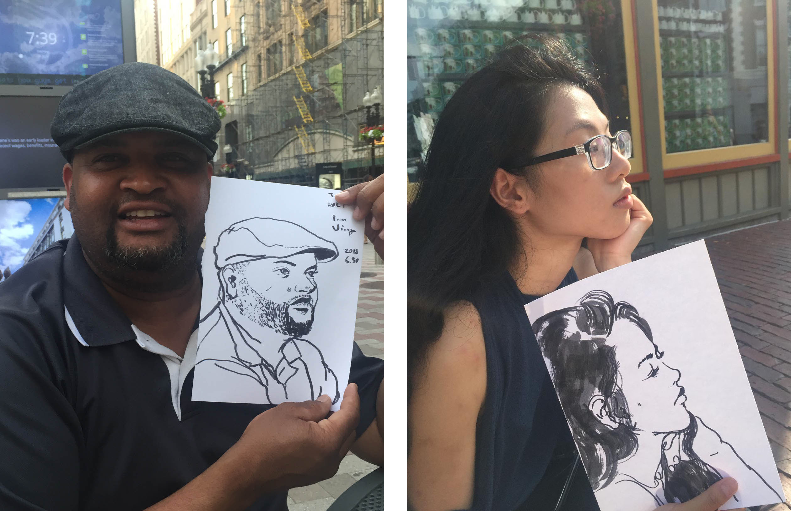
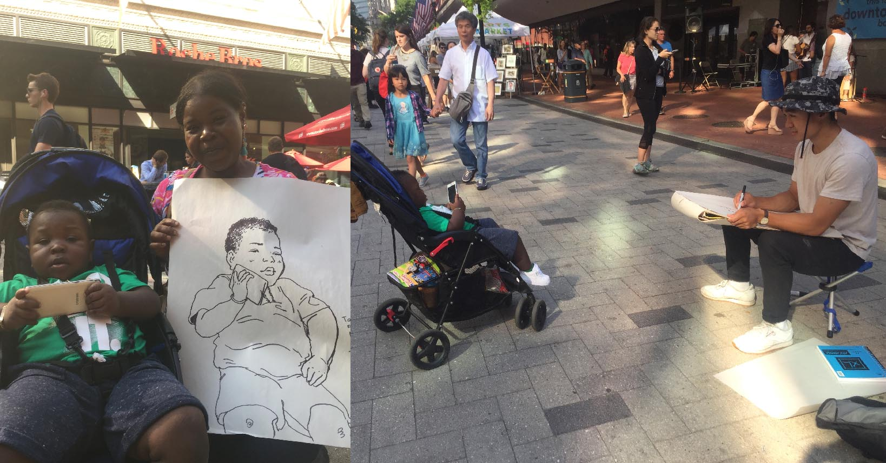
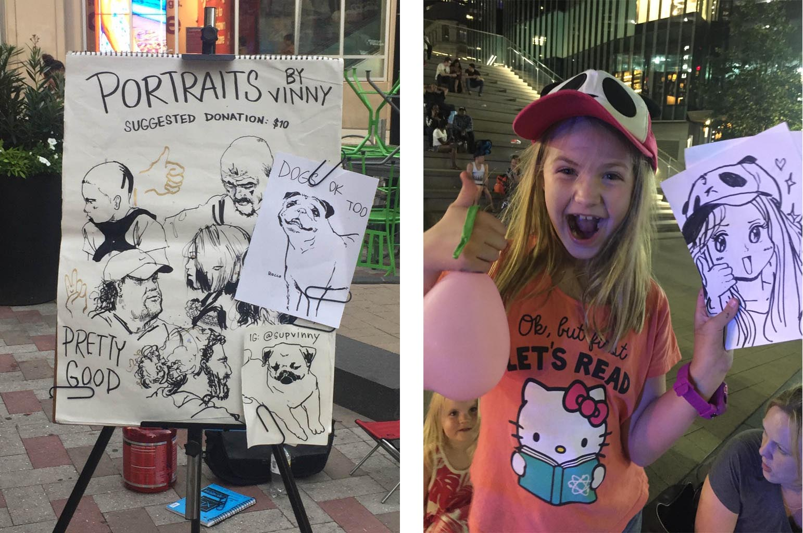

I had just moved to Boston and was working remotely for a few clients. The transition was jarring. I was very unprepared to be a freelancer. My hours slipped later and later, until eventually I was sleeping after the sun came up. So, I wrote a note to myself: 

- You need to SOCIALIZE EVERY DAY
- get into SUN 

The next day, I decided to be a portrait artist, like the ones I used to see as a kid in Times Square. I picked up some fold out seats, a drawing pad, some sunscreen and a bucket hat. I stepped out of the Red Line Station into Downtown Crossing and began my life as a portrait artist.

**So how much money is there to be made in street art?**

I initially charged $10/portrait with "suggested minimum donation" messaging. This seems ridiculously low to me now. But it also means customers give me whatever they feel like above $10. I noticed some kind of [pareto principle thing](https://www.8020curve.com/instructions.html) (20% of your customers will account for 80% of your results) going on, where a good fourth of customers were giving me $20s.

If we ranked customers using a power-law distribution based the 80-20 rule (within every 80-20 there's a recursive 80-20...so 4% of your customers are as valuable as 96% of your customers and so on), we'd see something like this:

*Not based on any data, only a rough intuition*

As you can see, most people fall below my "donation" floor of $10, shown in red...hypothetically these people could get their portraits drawn and not pay me anything, but experience the "emotional guilt tax". 

**Nobody did this except for some kids,** so social etiquette matters. We'll ignore everyone below $10, thinking of them as disinterested in the product.

The people who absolutely love the experience/result can end up paying much more. My Rank 1 customer in real-life gave me a 100 dollar bill.

If we average out paying customers with the model above, I'm getting $16.50 per portrait. This is pretty close to the actual number.
 
One day I did some timing - I did around 3 an hour. Which calculates to $49.50/hour...assuming that I'm working at high speed and people are lining up to get drawn.

But people aren't lining up to be drawn. 

*This was the main challenge.* The best street performers are completely fixated on volume. If you've ever seen a breakdancing group, you'll know that crowds draw crowds, even if the act itself is terrible. And what better way to get a crowd that insert yourself into a crowded space?

My "act" isn't performative, nor did I invest the time to make it so (everything in hindsight). The most people I had watching was probably 10. The key is to always have somebody lined up, because social proof matters a ton. 

But anyways. I'll stop rambling. Here are some stats from week 1:

*Week 1*

Not so great, huh? I was bummed too. 

Here's week 6:

*Week 7*

A lot better!

Short answer: I was able to cover all of my living expenses. To put this in context, I lived in Cambridge, an area above Boston metro known for having some nice colleges and its [high cost of living](https://www.rentjungle.com/average-rent-in-cambridge-rent-trends/)!

Longer answer: After I had learned my initial lessons though, my hourly revenue didn't change very much. By FAR the most meaningful change I made was upping my suggested donation from $10 to $20, and using a thicker, more official looking card-stock material.

There were a TON of optimizations I could have made. A larger, printed sign. More examples of my work. Portraits on canvases that could sell for $40. Mass-produced pop art canvases on the side. I wanted to stay light though, so I go move around and do things after I was done working. That meant everything had to fit in my bag. 

One could argue that you don't do something like this for the money. From talking to the other street performers though, I get the sense that it is PURELY for the money, because it allows them pursue their art on the side without the full-time employment. This brings me to the next question:

**Who else is out there?**

I would frequently see [The Human DJ](https://www.instagram.com/thehumandj/), one of the more popular street performers in Boston. He told me it was the quickest way to make money for now, and as soon as he saved enough, he would leave Boston and produce music full time (edit: As of 2019, he's moved to Atlanta and is doing this exactly). He's had a lot worse experiences than me because he's been doing this for so long, like getting shut down by police and getting robbed.

[Mr. Not Art](http://www.mettermedia.com/not-art-x-metter-media-interview/) was a grafitti artist. He sold his prints on the street while working on his own pieces in the meantime. He's been doing the same concept for 7 years now, and is having a hard time coming up with something new.

Ming was old. Like, very old. At one point I'd stop by and talk to him every day. He's one of those classically trained graduates of the Central Academy of Fine Art in Beijing. He works on his own paintings in the winter and draws realistic pastels of children in the summer. He's not too invested in his own work though. He just likes being able to go home when he wants.

**Who gets their portrait drawn?**

My drawing style wasn't popular with the tourist families. My audience skewed towards younger - lots of high schoolers and college students. A lot of people with creative, niche interests. A lot more locals. Otherwise, fairly even split of gender and race.

I had lots of people who said they liked to draw too and wished they kept at it.

**Make friends?**

 Talked to a lot of homeless people. Talked to a lot of bored people. Some kids who worked at the Primark would stop by every day and shill for me (pretend to by my customers).

**Was it enjoyable?**

I liked talking to people about their lives. 

I didn't actually like doing the actual portraits. 

It's mentally taxing to go for accuracy with a time constraint. An arbitrary comparison is to think of somebody timing you while you line up bowling pins as perfectly as you can. Then, repeat this for hours.

**What would you have done differently?**

Experiment with times and locations more. Track results better. I thought I would to better in Faneuil Hall, Boston's most touristy spot, but I rarely got any customers when I set up there (there was also more established competition).The weekend evenings worked best for me. This was when things were slowing down, and it was starting to get dark. Thursdays were always better than Fridays - I think people chill out on Thursdays, but are too eager to GO OUT on Fridays.

I realized that my mood would get lower when I went for long stretches without getting customers. I told myself that it was okay to take a break, buy some water, sit down, and do some light sketching while I got my energy back. I found that chatting with strangers without the intent of drawing them always boosted my mood. Your mood is important our there: it's most of the reason why people will engage or not engage with you.

*LEFT: You'll see how under-marketed I was.*

It's empowering to realize that you can make money completely independently, and with a creative skill nonetheless. So yes, hone your craft, but more importantly, work on marketing, because that'll account for the majority of your results.

