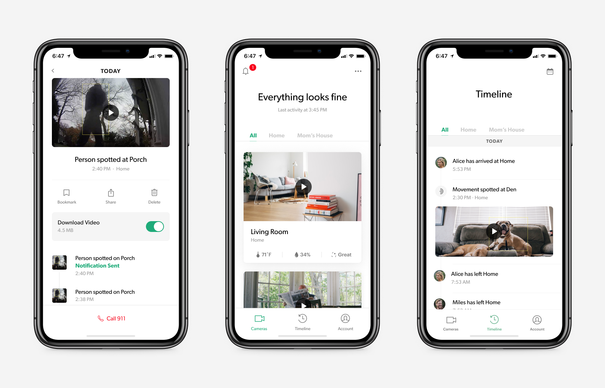

# App Redesign

In 2018, we recognized that our app was not only a hindrance to users trying to understand the way the Canary system worked, but also an impediment for us trying to promote Canary Premium - our new bundle of software subscription features.

Our objective in redesigning the app was to address the first-order consequences of , but the second and third order consequences that sprang from that 

# Trials

Riding the success of the app redesign, we looked into the trial experience.

PM Maciej Szelazek and I examined the most popular features as well as the features with the most percieved value, giving each a weighted score.

We tackled them one-by-one, building previews for each feature (visibility in accordance with priority) that aroused user curiosity and positioned Canary Premium as a way to avoid missing out.

# Apple's Ultimatum

In 2018, Apple told us unless we took sign-ups out of the app, it would be taken out of the store.

The problem: a trial opt-in (and web payments) to Canary Premium were offered as part of the sign-up process. Even if we took the subscriptions out, it wouldn’t matter: sign-ups had to disappear. (yes, these things can be very arbitrary)

Earlier in the year the same thing happened to Netflix and Spotify, which were prohibited from letting you sign up in-app and mentioning paid features in the app respectively.

Both companies found creative solutions. 

How could we invert a sub-optimal situation to an outcome that would be beneficial to our users and our business in the long run? To answer the question, our team took a deep dive into user data.

